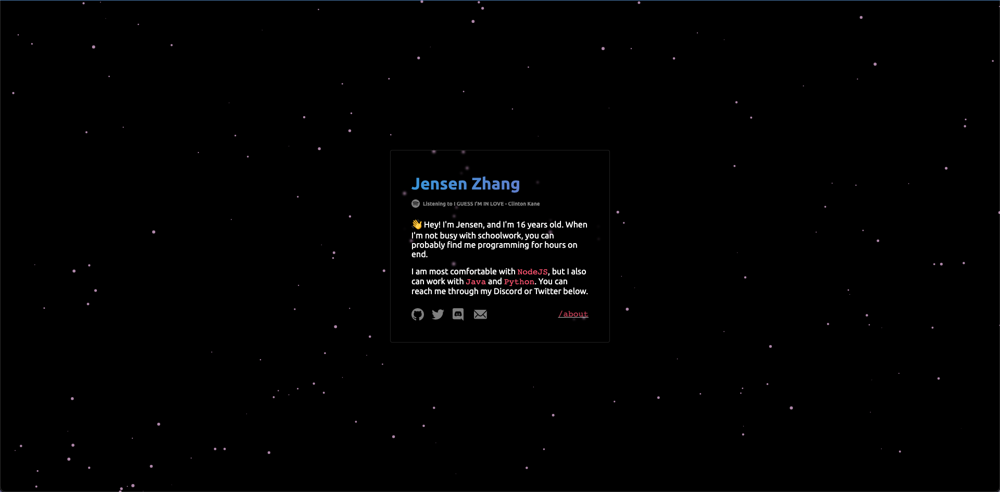

# My Personal Site

This project is a port of my pure HTML/JS/CSS site to ReactJS. I wrote this in about the span of 2 days while learning React, so the code may not be following every single React convention :P 

## Tech Stack
- [create-react-app](https://create-react-app.dev/)/[React](https://reactjs.org/)
- CSS3

## Want to run the site locally?
    - Clone this repository to your device
        `git clone https://github.com/jensenzhng/personal-website-react.git`
    - Install dependencies in root folder
        `npm i`
    - Run project
        `npm run start`

## Future
This site's always a work in progress, I'm always looking to add cool stuff to it :)
- [ ] Rework tech stack part of page
- [ ] Contact me part of page
- [ ] Possible TypeScript rewrite 

## Special thanks ❤️
- [Particles.js library](https://github.com/VincentGarreau/particles.js/)

